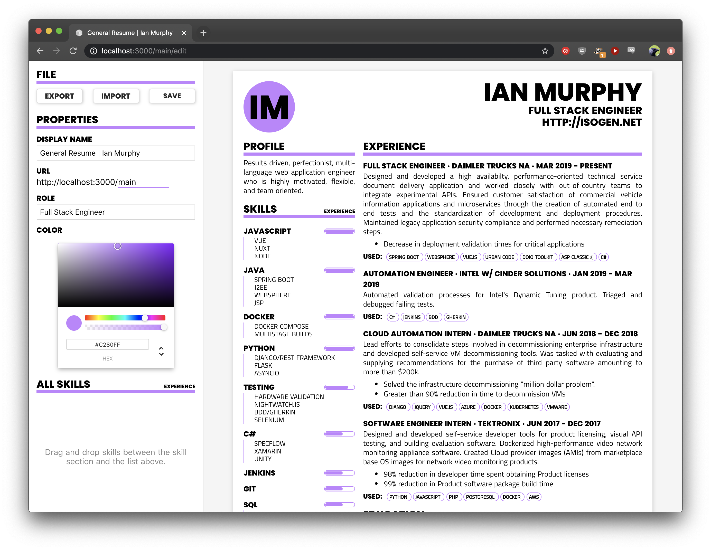

# Resume Generator (V3)
This is a web app I use to host and manage resumes for different job postings and such.  It's 100% custom and pretty cool imo.

# Features
* Export to JSON
* Import from JSON
* UI for changing:
  * Order of skills
  * Name of resume
  * Role/career
  * Color
  * URL for resume

# How to Use
1. Navigate to `/main/edit`
2. Login with password
3. Edit resume
4. Change slug to `whatever`
5. Save
6. Access your saved resume by going to `/whatever`

# Installation

## Docker
1. `docker run -p3000:3000 3jackdaws/resume:v3
2. Browse to `/main/edit`

## Node (development)
1. `git clone http://github.com/3jackdaws/resume-gen2 && cd resume-gen2`
2. `npm install`
3. `npm run dev`
4. Browse to `/main/edit`

Don't use my resume, obviously.  Export the default resume (mine), change the text of the JSON file until it's yours, and import it.  Make sure to click "SAVE" after import.

# Bugs
None (the code is literally perfect).
Actually, not true. It's kinda gross.

# Planned Features
* some way to import/export the layout of the resume

